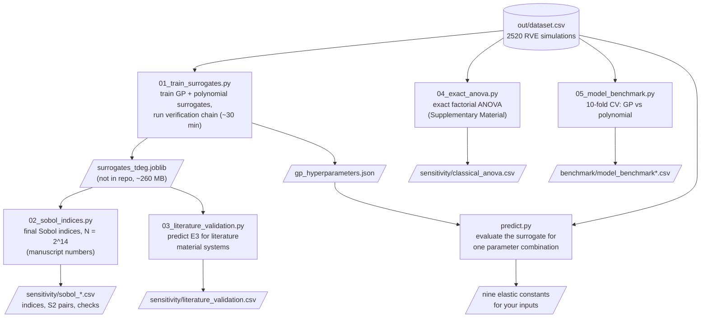

# Elastic properties of short natural-fibre composites: dataset, surrogates and sensitivity analysis

Data and code for the manuscript

> *Finite-element homogenisation and surrogate-assisted sensitivity
> analysis of elastic properties in short natural-fibre composites*
> (submitted to Composites Part C: Open Access, 2026).

The repository contains the full parametric finite-element homogenisation
dataset (2520 RVE simulations), the fibre-orientation sub-study (252
simulations), the scripts that train the machine-learning surrogates, the surrogate-based Sobol global sensitivity analysis with its
exact-factorial verification chain, the literature plug-in validation, and
the comparison with a polynomial surrogate.

## Contents

```
src/
  01_train_surrogates.py       trains the GP surrogate of record and the
                               polynomial cross-check per length
                               distribution and runs the verification chain
                               (exact grid ANOVA, grid-restricted Saltelli
                               check, polynomial cross-check)
  02_sobol_indices.py          final Sobol computation (centred estimator,
                               N = 2^14): continuous indices, second-order
                               pairs, 6-factor headline table, conditional
                               indices at fixed compositions
  03_literature_validation.py  plugs literature material data into the
                               surrogate and compares predicted E3
  04_exact_anova.py            exact factorial ANOVA on the design grid
                               (Supplementary Material)
  05_model_benchmark.py        10-fold cross-validation of the GP and the
                               polynomial surrogate
  predict.py                   evaluates the Gaussian-process surrogate for
                               one parameter combination (see below)
  surrogate_gp.py              definition of the surrogate of record
  surrogate_poly.py            definition of the polynomial comparison
                               surrogate
  out/
    gp_hyperparameters.json       fitted kernel hyperparameters of the GP
    dataset.csv                   the 2520-run dataset (see below)
    orientation_dataset.csv       the 252-run orientation sub-study (see below)
    test_set/*.csv                the 60-point independent test set (see below)
    sensitivity/*.csv             Sobol indices, verification checks,
                                  literature validation inputs and results
    benchmark/*.csv               cross-validation scores of the two models
```

## Workflow



Just want property predictions? Only `predict.py` is needed — it
rebuilds the GP surrogate from the dataset on first use (about a minute,
no training pipeline required):

```
pip install -r requirements.txt
cd src
python predict.py --vf 0.20 --efem 20 --alpha 2 --lp 100 --kappa 10 --dist exponential
```

See [Using the surrogate](#using-the-surrogate) for the meaning of the
inputs and how to call the surrogate from your own code.

## The dataset

`src/out/dataset.csv` holds one row per homogenised RVE and stiffness
contrast, 2520 rows in total (360 geometries times 7 modulus ratios).

| column | meaning |
| --- | --- |
| `fiber_fraction` | fibre volume fraction v_f (0.10 to 0.30, 5 levels) |
| `Ef_Em` | fibre-to-matrix modulus ratio E_f/E_m (4 to 48, 7 levels) |
| `width_to_thickness_ratio` | cross-section aspect ratio alpha (1, 2, 3) |
| `length_value` | projected fibre length L_p in micrometres (50, 100, 200); the fixed length for the constant distribution and the distribution parameter for the truncated exponential |
| `theta` | fibre waviness level, the von Mises-Fisher concentration kappa_theta (0, 5, 10, 20; 0 means straight fibres); the analysis scripts map it to the mean deviation inclination in degrees |
| `length_distribution_type` | `constant` or `exponential` |
| `sim`, `random_seed` | simulation batch and RVE realisation seed |
| `box_x`, `box_z` | RVE box dimensions in micrometres |
| `E1_Em` ... `v23` | the nine homogenised constants; moduli are normalised by the matrix modulus, direction 3 is the fibre direction; the RVEs are transversely isotropic by construction, so the pairs (E1, E2), (G13, G23) and (v13, v23) agree within realisation scatter |
| `L_band` | helper label for the length level |

## The orientation dataset

`src/out/orientation_dataset.csv` holds the fibre-orientation sub-study of
the manuscript: 36 RVEs homogenised at the same seven modulus ratios, 252
rows in total. The Hermans orientation parameter of the fibre population is
varied over 0.40, 0.66, 0.85 and 0.96 at three constant fibre lengths and
three fibre contents, with alpha = 2 and the calibrated waviness
(kappa_theta = 10), plus one exponential-length group at 0.66. The aligned
state at the shortest length is covered by the main dataset. The cells are
wider than in the main design so that misaligned fibres stay decorrelated
from their periodic images.

| column | meaning |
| --- | --- |
| `set`, `sim`, `random_seed` | simulation batch, RVE identifier and realisation seed |
| `fiber_fraction` | fibre volume fraction v_f (0.10, 0.20, 0.30) |
| `box_x`, `box_y`, `box_z` | RVE cell dimensions in micrometres |
| `fiber_clearance` | minimum gap kept between fibres during packing, micrometres |
| `length_type` | `constant` or `exponential` |
| `length_const`, `length_min`, `length_scale`, `length_mean` | projected fibre length in micrometres: the fixed length for the constant distribution, and the minimum, scale parameter and nominal mean for the truncated exponential |
| `width_to_thickness`, `thickness` | cross-section aspect ratio alpha (2) and fibre thickness D (10 micrometres) |
| `incl_type`, `incl_kappa`, `azim_kappa`, `deviation_magnitude`, `twistrate` | backbone generation settings: von Mises-Fisher inclination with kappa_theta = 10, azimuth concentration 0.2, deviation magnitude 0.35 L_p, no twist |
| `orientation_dependency` | Hermans orientation parameter f_H of the fibre population (0.40, 0.66, 0.85, 0.96) |
| `case`, `fiber_modulus`, `matrix_modulus` | modulus-ratio index and the fibre and matrix moduli; the matrix modulus is 1, so `fiber_modulus` equals E_f/E_m |
| `E1` ... `v23` | the nine homogenised constants normalised by the matrix modulus, direction 3 being the mean fibre direction |

## The independent test set

`src/out/test_set/` holds the 30 additional RVEs used to test the
surrogate between the design levels: `test_set_design.csv` (inputs drawn
by Latin hypercube sampling inside the design window, two modulus ratios
per RVE), `test_set_fe_results.csv` (the 60 homogenised property sets, same
column layout as the orientation dataset), `test_set_surrogate_predictions.csv`
(GP and polynomial predictions at the same points) and `test_set_comparison.csv`
(error per constant and model).

## Using the surrogate

The surrogate of the manuscript is a Gaussian process (Matern-5/2 kernel
on standardised inputs, fitted to the logarithm of each constant; see
`src/surrogate_gp.py`). The trained models are too large for the
repository, so `predict.py` rebuilds them on first use from the dataset
with the fitted kernel hyperparameters in `src/out/gp_hyperparameters.json`
(about a minute, no optimisation) and caches them locally. It then
evaluates them for one parameter combination and prints the nine
constants:

```
cd src
python predict.py --vf 0.20 --efem 20 --alpha 2 --lp 100 --kappa 10 --dist exponential
```

The inputs are the fibre volume fraction, the fibre-to-matrix modulus
ratio, the cross-section aspect ratio, the projected fibre length in
micrometres (nominal mean for the exponential distribution), the waviness
level `kappa_theta` (0 = straight, 20, 10, 5; or `--tdeg` for the mean
deviation inclination in degrees) and the length distribution. The
surrogate is trained on the design window of the dataset (v_f 0.10 to
0.30, E_f/E_m 4 to 48, alpha 1 to 3, L_p 50 to 200 um) and warns when an
input lies outside it. The fibre thickness of the dataset is 10 um; for
fibres of another thickness, scale the length by the thickness ratio. To
use the models in your own code:

```python
from predict import predict
predict(vf=0.20, efem=20, alpha=2, lp=100, tdeg=25.8, dist='exponential')
```

## Reproducing the analysis

```
pip install -r requirements.txt
cd src
python 01_train_surrogates.py
python 02_sobol_indices.py
python 03_literature_validation.py
python 04_exact_anova.py
python 05_model_benchmark.py
```

All scripts use fixed random seeds, so the outputs in `src/out/` are
reproduced exactly. The trained surrogate bundle
(`src/out/sensitivity/surrogates_tdeg.joblib`, about 260 MB because the
Gaussian processes store their training matrices) is not stored in the
repository;
`01_train_surrogates.py` regenerates it from the dataset in about half an
hour and also rewrites `gp_hyperparameters.json` used by `predict.py`.

The RVE generation, periodic meshing and finite-element homogenisation that
produced the dataset were carried out with the in-house microstructure
framework described in Verho et al., Composites Science and Technology 230
(2022) 109713, https://doi.org/10.1016/j.compscitech.2022.109713.

## License

The code under `src/` is released under the MIT License, see `LICENSE`.
The dataset and the result CSV files are released under the Creative
Commons Attribution 4.0 International licence (CC BY 4.0), see
`LICENSE-DATA.md`.

## Citation

Citation details will be added on acceptance of the manuscript.
